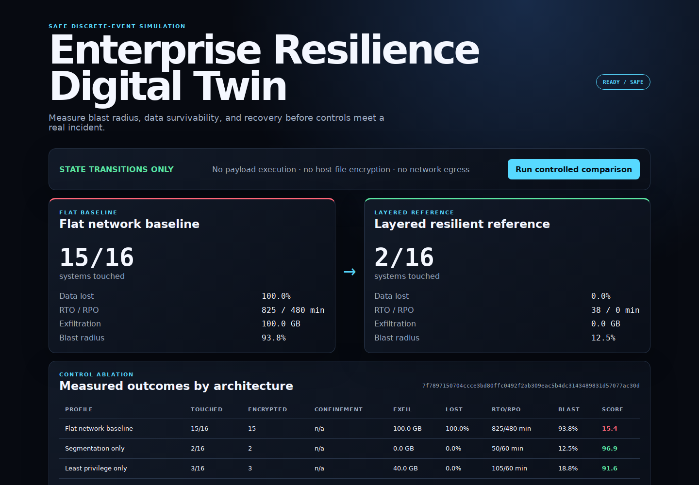

# ransomware-digital-twin

A safe, deterministic digital twin for measuring how enterprise architecture
changes the operational outcome of a ransomware-like incident.

The project models sixteen systems across endpoints, identity, data, business,
security, and recovery zones. A closed state machine progresses through initial
access, credential scope change, lateral movement, simulated data-egress counters,
impact flags, and recovery-point inhibition. It compares a flat baseline with
segmentation, least privilege, immutable backup, and a layered detection-response
reference.

> No command or payload is generated or executed. No host file is encrypted. No
> data leaves the process. “Encryption”, “exfiltration”, and “backup destruction”
> are names for in-memory state transitions and numeric counters only.

## Dashboard Preview



Controlled simulation using the repository’s example environments and profiles.

## Measured reference experiment

The committed [golden report](golden/2026-07-13/report.md) contains a reproducible
five-profile experiment:

| Architecture | Systems touched | Critical compromise | Confinement | Encrypted | Exfiltrated | Data lost | RTO / RPO | Blast radius | Score |
|---|---:|---:|---:|---:|---:|---:|---:|---:|---:|
| Flat baseline | 15/16 | 50 s | n/a | 15 | 100 GB | 100% | 825 / 480 min | 93.8% | 15.4 |
| Segmentation only | 2/16 | none | n/a | 2 | 0 GB | 0% | 50 / 60 min | 12.5% | 96.9 |
| Least privilege only | 3/16 | 50 s | n/a | 3 | 40 GB | 0% | 105 / 60 min | 18.8% | 91.6 |
| Immutable backup only | 15/16 | 50 s | n/a | 15 | 100 GB | 0% | 195 / 15 min | 93.8% | 59.9 |
| Layered reference | 2/16 | none | 47 s | 0 | 0 GB | 0% | 38 / 0 min | 12.5% | 97.1 |

These numbers demonstrate the simulator and its assumptions, not a forecast for a
real organization. The ablation is intentionally revealing: immutable backup
eliminates modeled data loss but does not reduce compromise or exfiltration, while
segmentation limits spread but does not itself contain the two affected endpoints.

Functional experiment SHA-256:
`7f7897150704ccce3bd80ffc0492f2ab309eac5b4dc3143489831d57077ac30d`.

## Architecture

```text
integrity-pinned topology + profiles + controlled scenario
                           |
                 strict contract validation
                           |
                  discrete-event scheduler
              +------------+-------------+
              |                          |
       incident transitions      defense transitions
       (state/counters only)      (detect / contain)
              +------------+-------------+
                           |
       chained causal ledger + operational metrics
                           |
       JSON / JSONL / CSV / Markdown / API / dashboard
```

The runtime uses only the Python standard library. Input JSON rejects duplicate
keys, unknown properties, path traversal, unsupported primitives, malformed
references, and hash mismatches. See [Architecture](docs/ARCHITECTURE.md) and the
[Safety case](docs/SAFETY_CASE.md).

## Enterprise twin

The model contains:

- six user workstations split across finance, HR, operations, development, and
  executive zones;
- a primary identity service;
- payroll and shared file services;
- payroll, ERP, and customer-facing business services;
- backup control and recovery vault systems;
- security analytics and response orchestration;
- fourteen explicit access paths and five business dependencies.

The scenario is a fixed set of twenty allowlisted actions. A profile can change
only network mode, acquired privilege scope, backup immutability, detection timing,
response timing, and backup intervals. It cannot add executable content.

## Quick start

Python 3.10–3.12 is supported and the runtime has no third-party dependency.

```bash
python -m venv .venv
. .venv/bin/activate
python -m pip install -r requirements-build.lock -r requirements-dev.lock
python -m pip install --no-build-isolation --no-deps -e .

ransomware-twin validate
ransomware-twin compare --output-dir out/comparison
ransomware-twin serve --host 127.0.0.1 --port 8080
```

Open `http://127.0.0.1:8080` for the comparison dashboard and causal timeline.

For the hardened container:

```bash
docker compose up --build
```

Compose binds to loopback, uses a non-root user and read-only filesystem, drops all
Linux capabilities, enables `no-new-privileges`, and applies process, CPU, and
memory limits.

## CLI and API

```text
ransomware-twin validate
ransomware-twin profiles
ransomware-twin simulate --profile PROFILE [--full]
ransomware-twin compare [--profiles PROFILE ...] [--output-dir PATH] [--full]
ransomware-twin serve [--host HOST] [--port PORT]
```

HTTP endpoints:

| Method | Endpoint | Contract |
|---|---|---|
| GET | `/api/v1/health` | Safety mode and runtime status |
| GET | `/api/v1/topology` | Reviewed enterprise model |
| GET | `/api/v1/profiles` | Available control configurations |
| POST | `/api/v1/simulate` | Exactly `{"profile_id":"…"}` |
| POST | `/api/v1/compare` | Exactly `{"profile_ids":["…","…"]}` |

The API accepts no topology, scenario, script, command, target address, or rule
upload. Bodies are capped at 16 KiB and duplicate/extra fields fail closed.

## Metrics

Each simulation produces:

- time to first critical compromise, last compromise, detection, and confinement;
- systems touched and encrypted, including exact identifiers and zone distribution;
- primary data encrypted, counter-only exfiltration, irrecoverable data, and loss
  percentage;
- RTO, RPO, service outages, raw and criticality-weighted blast radius;
- stages completed, controls that blocked events, and a composite resilience score;
- a complete event ledger in which every record commits to the previous hash.

Definitions and formulas are documented in [Methodology](docs/METHODOLOGY.md).

## Reproducible evidence

`golden/2026-07-13/` contains:

- the complete JSON comparison;
- 102 JSONL causal events with five independent hash chains;
- a profile metrics CSV;
- a human-readable Markdown report;
- a manifest pinning every file and the functional digest.

Wall-clock execution time is measured honestly but excluded from functional
reproducibility. Simulated incident time, decisions, state, metrics, profiles,
topology hashes, and event hashes remain part of the functional digest.

```bash
python scripts/quality_gate.py
python scripts/verify_golden.py
```

## Quality gates

```bash
make test
make quality
```

CI runs Python 3.10, 3.11, and 3.12. It enforces formatting, lint, strict typing,
compilation, 26 unit/integration/end-to-end tests, source-surface safety, functional
determinism, expected before/after metrics, event-chain integrity, golden-file
identity, wheel packaging, and a constrained Docker validation. Build tools, base
image, and CI actions are pinned.

## Repository map

```text
src/ransomware_twin/
  bundle/       integrity-pinned topology, scenario, and control profiles
  simulator.py  discrete-event state machine and resilience metrics
  audit.py      causal hash chains
  api.py        bounded local API
  web/          dependency-free comparison dashboard
tests/          unit, integration, API, CLI, tamper, and safety tests
scripts/        safety, determinism, and golden-evidence gates
golden/         committed measured experiment
docs/           architecture, methodology, contracts, threat model, limitations
```

## Honest limits

This is a controlled decision-support demonstrator, not malware, an attack tool, a
production cyber range, or an actuarial loss model. Read
[Limitations](docs/LIMITATIONS.md) before interpreting results and
[SECURITY.md](SECURITY.md) before reporting issues.

## License

MIT — see [LICENSE](LICENSE).
